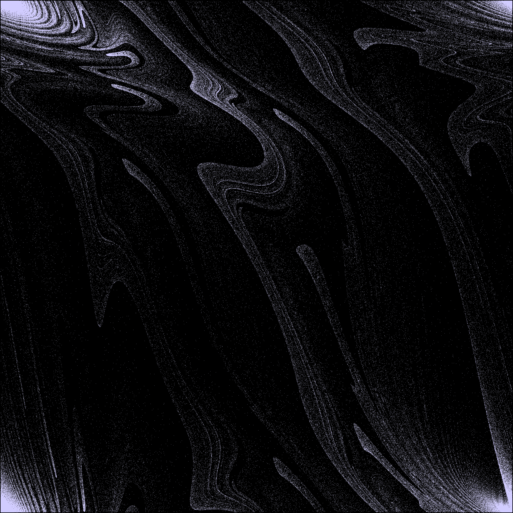

# Convolution


```Julia
using GPUArrays, Colors, FileIO, ImageFiltering
using CLArrays

img = RGB{Float32}.(load(joinpath(@__DIR__, "..", "Poincare", "poincare.png")))

a = CLArray(img);
out = similar(a);
k = CLArray(Float32.(collect(Kernel.gaussian(7))));
imgc = similar(img)

GPUArrays.convolution!(a, out, k)
copy!(imgc, out)
save(joinpath(@__DIR__, "gaussian.png"), imgc)
```

Before:
 
